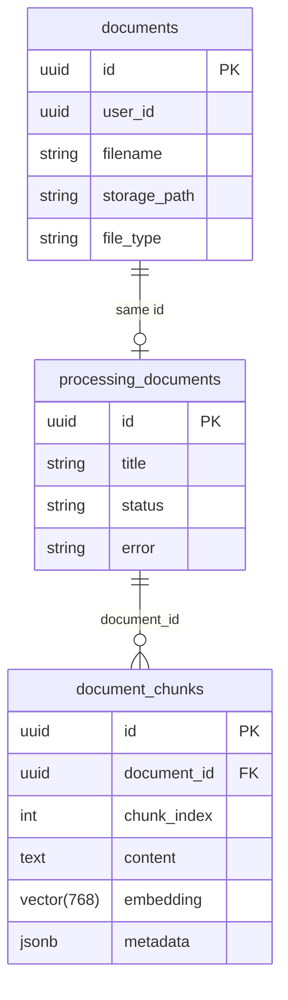
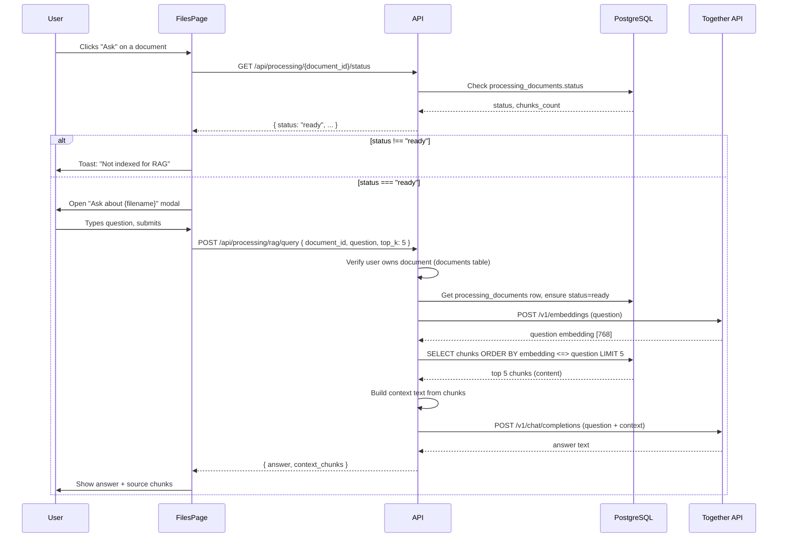
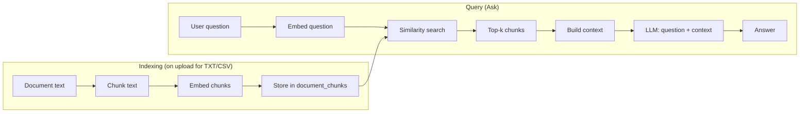

# RAG System: How "Ask" Works

This document explains what happens when you click **Ask** on a document in the Files page: which databases are used, how the RAG pipeline works, and how the frontend and API interact.

---

## Overview

The RAG (Retrieval-Augmented Generation) system lets you ask questions about a specific document. Only **text** and **CSV** files are indexed for RAG; PDFs and images are stored but not searchable. When you click **Ask**:

1. The frontend checks that the document is **indexed** (status `ready`).
2. You type a question and submit.
3. The API embeds your question, finds the most relevant **chunks** of the document (vector similarity), then asks an LLM to answer using only that context.

---

## Databases Used

All persistent data lives in **one PostgreSQL database** (Supabase). There are **three tables** involved in the RAG flow:

| Table | Purpose |
|-------|--------|
| **`documents`** | Uploaded file metadata: `user_id`, `filename`, `storage_path`, `file_type`, etc. One row per uploaded file. |
| **`processing_documents`** | RAG processing state per document: `id` (same UUID as `documents.id`), `title`, `status` (`pending` \| `processing` \| `ready` \| `error`), `error` message. |
| **`document_chunks`** | Chunked text + embeddings for RAG: `document_id` (FK to `processing_documents.id`), `chunk_index`, `content`, **`embedding`** (pgvector 768-d), `metadata` (JSONB). |

- **File bytes** are stored in **Supabase Storage**, not in PostgreSQL. The `documents` table only stores the path and metadata.
- **Embeddings** are stored in `document_chunks.embedding` (pgvector). The app uses **cosine distance** (`<=>`) to find the closest chunks to the question embedding.

---

## End-to-End Flow When You Click "Ask"

---

## Step-by-Step: What Happens on "Ask"

### 1. User clicks **Ask** on a file row

- **Frontend** (`apps/web/src/app/dashboard/files/page.js`): `handleAskClick(doc)` runs.
- It calls **`GET /api/processing/{document_id}/status`** with the user’s JWT.
- **API** (`apps/api/app/processing/router.py`): `get_status` verifies the user owns the document (via `documents` table), then reads `processing_documents` for that `document_id` and returns `status`, `chunks_count`, and optional `error`.
- If **`status !== "ready"`**, the frontend shows a toast: *"This document is not indexed for RAG. Upload TXT or CSV files to enable questions."* and does not open the modal.
- If **`status === "ready"`**, the frontend opens the **Ask about {filename}** modal and stores `askDocumentId` and `askDocumentName`.

### 2. User types a question and submits

- **Frontend**: `handleQuerySubmit` runs. It sends **`POST /api/processing/rag/query`** with body:
  - `document_id`: UUID of the document
  - `question`: user’s question string
  - `top_k`: 5 (number of chunks to retrieve)

### 3. API: RAG query handler

- **Router** (`processing/router.py`): `rag_query` receives the request, verifies **document ownership** again via `documents` (user must own the file).
- It then calls **`ProcessingService.rag_query(db, document_id, question, top_k=5)`**.

### 4. RAG pipeline inside the API (`processing/service.py`)

1. **Load processing record**  
   - Ensure a `processing_documents` row exists for `document_id` and **`status == "ready"`**. If not, return 400/404.

2. **Embed the question**  
   - `embed([question])` is called.  
   - With **TOGETHER_API_KEY** set: HTTP POST to **Together API** `https://api.together.xyz/v1/embeddings` with model **BAAI/bge-base-en-v1.5** (768 dimensions).  
   - Without key: fallback to a deterministic hash-based “embedding” (same dims).  
   - Result: one vector **qvec** of length 768.

3. **Vector similarity search**  
   - The code resolves the pgvector schema (`public`, `extensions`, or `vector_db`) so `vector` and `<=>` work.  
   - It runs a parameterized raw SQL query on **`document_chunks`**:
     - **WHERE** `document_id = :document_id`
     - **ORDER BY** `embedding <=> :qvec` (cosine distance, ascending = most similar first)
     - **LIMIT** `:limit` (top_k, default 5)
   - Only rows for this document are considered. The **database** (PostgreSQL + pgvector) does the similarity search.

4. **Build context**  
   - The top-k rows are turned into `ChunkResponse` objects.  
   - Their `content` is concatenated into a single string with separators:  
     `"[Chunk 0]\n{content}\n\n---\n\n[Chunk 1]\n{content}\n\n---\n\n..."`

5. **Generate answer**  
   - `generate_answer(question, context_text)` is called.  
   - With **TOGETHER_API_KEY**: HTTP POST to **Together API** `https://api.together.xyz/v1/chat/completions` with:
     - **Model**: e.g. `meta-llama/Llama-3.3-70B-Instruct-Turbo` (from config).
     - **System message**: instructs the model to answer using ONLY the provided context and to say when information is insufficient.
     - **User message**: `"Question: {question}\n\nContext:\n{context}"`
     - Temperature 0.2, max_tokens from config.
   - Without key: returns a message saying no LLM is configured and shows the raw context.

6. **Return**  
   - The handler returns **`QueryResponse`**: `document_id`, `question`, `answer`, and `context_chunks` (the top-k chunks used).

### 5. Frontend displays the result

- The modal shows the **answer** and, if present, the **source chunks** (`context_chunks`) so the user can see which parts of the document were used.

---

## How RAG Actually Works (Conceptually)

- **Indexing** (done when you upload a TXT/CSV, or via **Process**):  
  - Text is **chunked** (e.g. 900 chars, 150 overlap).  
  - Each chunk is **embedded** with the same model (BAAI/bge-base-en-v1.5, 768-d).  
  - Chunks and embeddings are stored in **`document_chunks`** in PostgreSQL.

- **Query (Ask)**:  
  - The **question** is embedded with the **same** model.  
  - **Vector search**: find chunks whose `embedding` is closest to the question vector (cosine distance in the DB).  
  - The **top-k** chunks form the **context**.  
  - The **LLM** gets the question plus this context and is instructed to answer only from the context (RAG).

So: **one database** (PostgreSQL/Supabase) holds documents metadata, processing status, and chunk embeddings; **Supabase Storage** holds file bytes; **Together API** is used for embeddings and for the final answer.

---

## Summary Table

| Step | Where | What |
|------|--------|------|
| Click Ask | Web (Files page) | GET `/api/processing/{id}/status` |
| Check status | API + PostgreSQL | Read `processing_documents` for `document_id` |
| Open modal | Web | If status is `ready`, show Ask modal |
| Submit question | Web | POST `/api/processing/rag/query` with `document_id`, `question`, `top_k` |
| Ownership | API + PostgreSQL | Ensure user owns document via `documents` |
| Embed question | API → Together | `POST /v1/embeddings` (BAAI/bge-base-en-v1.5) |
| Similarity search | API + PostgreSQL | `document_chunks` ORDER BY `embedding <=> qvec` LIMIT top_k |
| Build context | API | Concatenate top-k chunk contents |
| Generate answer | API → Together | `POST /v1/chat/completions` (Llama etc.) with context |
| Show result | Web | Display `answer` and `context_chunks` in modal |

**Databases / storage:**

- **PostgreSQL (Supabase)**: `documents`, `processing_documents`, `document_chunks` (with pgvector).
- **Supabase Storage**: raw file bytes (referenced by `documents.storage_path`).
- **Together API**: embeddings and chat completions (no DB).
