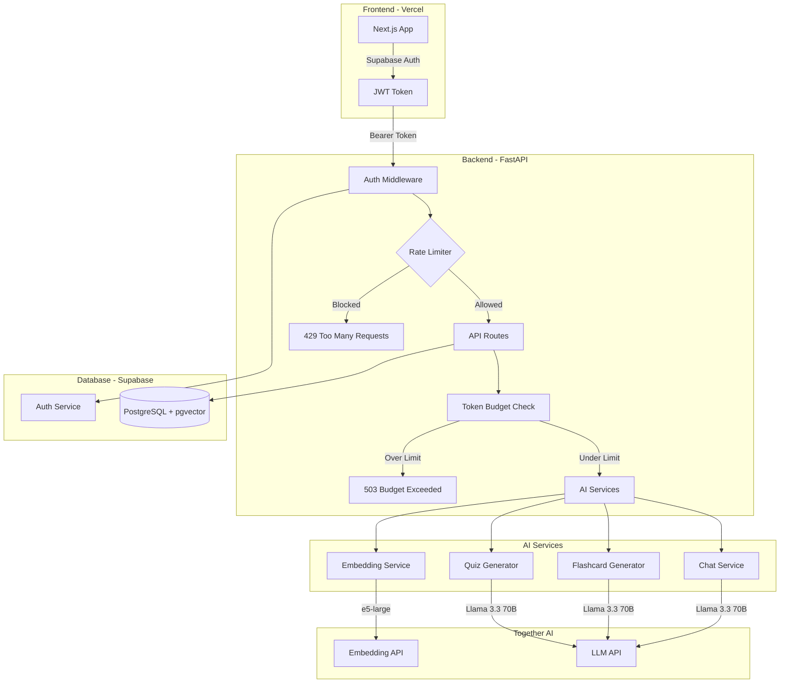
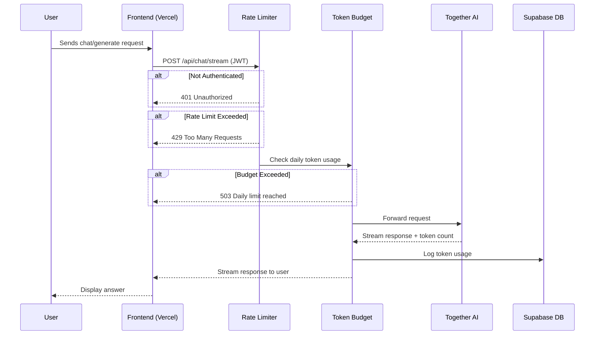
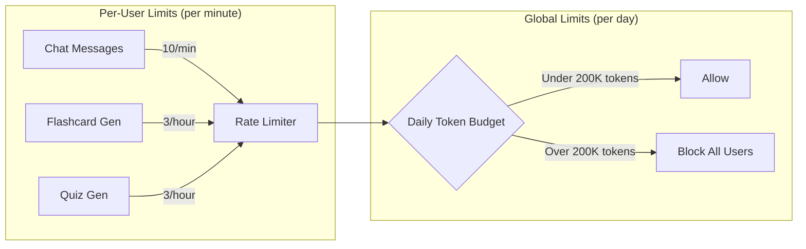
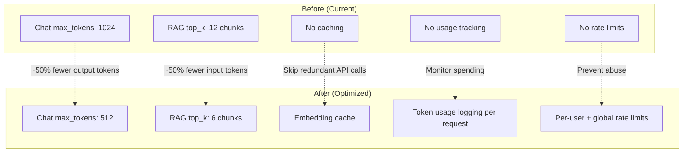
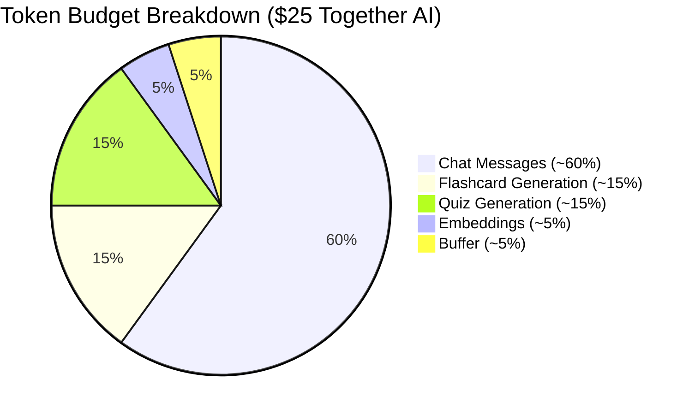
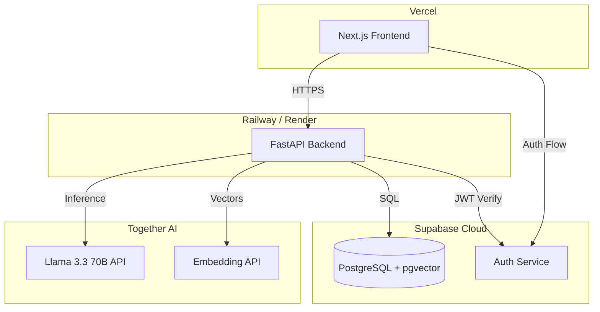

# StudyBudd Deployment & API Cost Optimization Plan

## Overview

Deploy StudyBudd to Vercel (frontend) with a protected FastAPI backend,
optimized to keep Together AI costs under $25 for a LinkedIn demo.

---

## Architecture



---

## Request Flow with Protections



---

## Rate Limiting Strategy



---

## Token Optimization Changes



---

## Estimated Token Budget



---

## Cost Estimation

```
+-------------------------+------------------+------------------+
| Scenario                | Tokens Used      | Estimated Cost   |
+-------------------------+------------------+------------------+
| LinkedIn Demo (~50 ppl) | ~1.5M tokens     | ~$1.50 - $3.00   |
| Medium traffic (200 ppl)| ~6M tokens       | ~$6.00 - $10.00  |
| Heavy usage (500 ppl)   | ~15M tokens      | ~$13.00 - $20.00 |
| Daily cap (safety net)  | 200K tokens/day  | ~$0.18/day max   |
+-------------------------+------------------+------------------+
```

---

## Implementation Checklist

```
Phase 1: API Protection (Must-have before deploy)
=================================================
[x] Add in-memory rate limiter middleware to FastAPI
    - 10 requests/min per user for chat
    - 3 requests/hour per user for flashcard/quiz generation
[x] Add global daily token budget tracker
    - Hard cap at 200K tokens/day
    - Return 503 when exceeded
[x] Verify all AI endpoints require Supabase JWT auth

Phase 2: Token Optimization
============================
[x] Reduce chat max_tokens: 1024 -> 512
[x] Reduce flashcard/quiz RAG top_k: 12 -> 6
[x] Add token usage logging per request
[ ] Cache document embeddings (skip re-embedding)

Phase 3: Frontend Safeguards
==============================
[x] Add request debouncing on chat input
[x] Show user-friendly error on rate limit (429)
[x] Show user-friendly error on budget exceeded (503)

Phase 4: Deploy
================
[ ] Replace Together AI API key with your own
[ ] Deploy frontend to Vercel
[ ] Deploy backend (Railway / Render / Fly.io)
[ ] Set environment variables in production
[ ] Test end-to-end flow
```

---

## Deployment Architecture



---

## Files to Modify

```
apps/api/
  app/
    main.py              -> Add rate limiter middleware
    core/
      config.py          -> Add rate limit + budget settings
      rate_limiter.py    -> NEW: Rate limiting logic
      token_budget.py    -> NEW: Daily token budget tracker
    inference/
      client.py          -> Add token usage logging
    chat/
      service.py         -> Reduce max_tokens
    flashcards/
      service.py         -> Reduce top_k
    quizzes/
      service.py         -> Reduce top_k

apps/web/
  src/app/
    dashboard/chat/
      hooks/useChatMessages.js -> Add debounce + error handling
```
